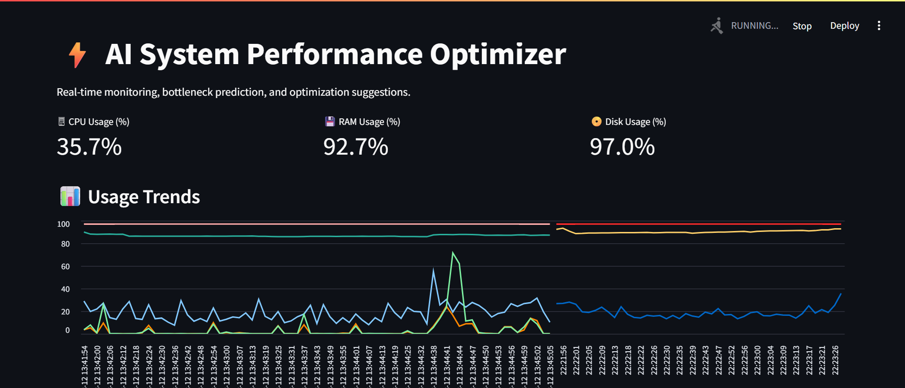
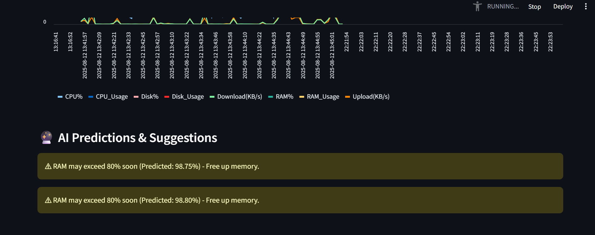

# 🚀 AI System Performance Optimizer

## 📌 Overview
The *AI System Performance Optimizer* is a real-time monitoring tool built with *Python, **Streamlit, and **scikit-learn*.  
It continuously tracks hardware usage, predicts potential bottlenecks, and provides intelligent optimization recommendations to keep your system running at peak efficiency.

---

## ✨ Features
- 📊 *Real-time system monitoring* — CPU, RAM, Disk, and Network usage
- 🤖 *AI-powered anomaly detection* — Flags unusual resource usage
- 📈 *Performance prediction* — Identifies possible bottlenecks before they happen
- 🌐 *Web-based dashboard* — Built using Streamlit for easy visualization
- ⚡ *Lightweight & fast* — Minimal resource usage

---

## 🛠 Installation

1. *Clone this repository*
   ```bash
   git clone https://github.com/woobly-bop/AI-SYSTEM-PERFORMANCE-OPTIMIZER.git
   cd AI-SYSTEM-PERFORMANCE-OPTIMIZER

2. *Install Dependencies*
   Make sure you have Python 3.8+ installed, then run:
   pip install -r requirements.txt

3. *Run the Project*
   streamlit run main.py

4. *Access the Dashboard*
   Once the server starts, open your browser and go to:
   http://localhost:8501

## 📂 Project Structure
AI-SYSTEM-PERFORMANCE-OPTIMIZER/
│
├── main.py              # Main application script
├── requirements.txt     # Python dependencies
├── README.md            # Project documentation
└── LICENSE              # License file

## 📸 Screenshots




## 📌 Future Improvements
•   Add GPU usage monitoring
•	Integrate email/SMS alerts for performance spikes
•	Implement historical data visualization
•	Add container & VM monitoring support

## 🤝 Contributing
Contributions are welcome!
Feel free to fork this repo, create a new branch, and submit a pull request.

## 💡 Author
Deep Kiran Kaur — Developer of AI System Performance Optimizer
🔗 [woobly-bop](https://github.com/woobly-bop)


